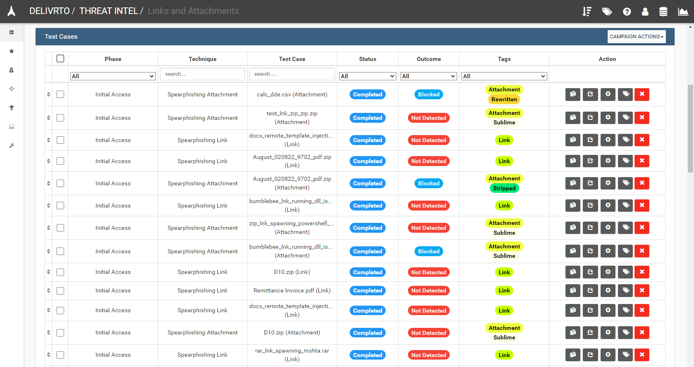
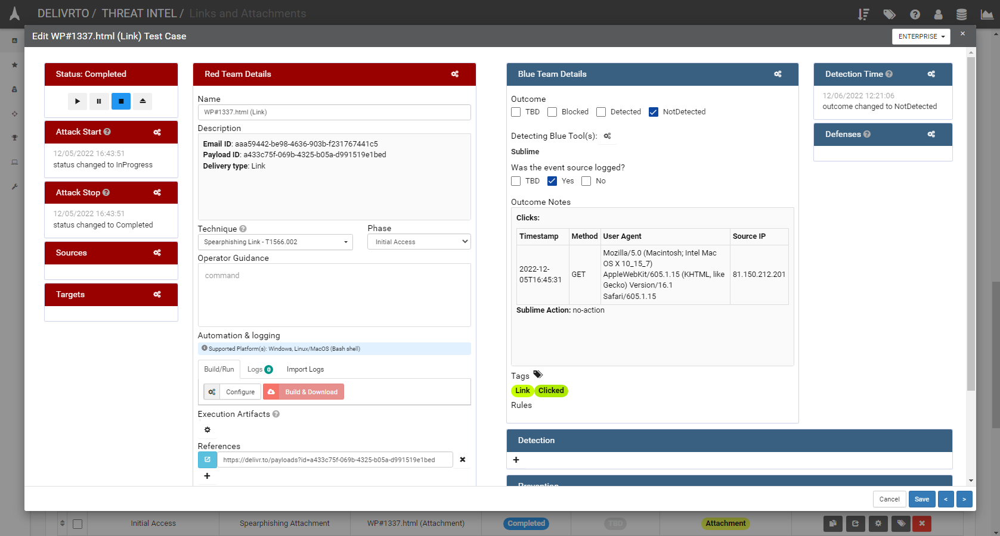
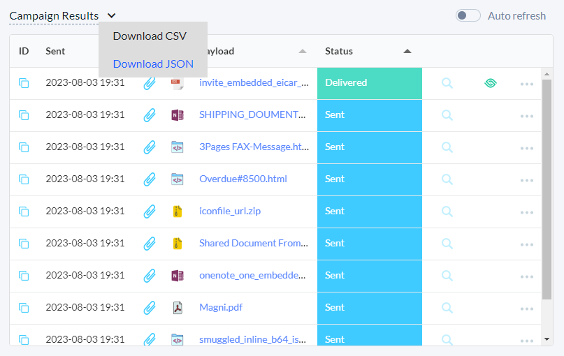

# delivr.to VECTR results importer

This python tool allows for easy importing of delivr.to campaign results into a VECTR instance.

Upon executing, the tool will generate a new assessment and campaign in VECTR (if either is not already present), and adds all payloads as individual test cases. The following data is added to each test case (where relevant):

- Email outcome (e.g. Blocked, Detected, Stripped, Link Rewritten, etc.)
- Link Clicks
- Sublime Security Rules Triggered  





## Installation

To install the `delivrto_vectr_import.py` tool, first `pip` install the required dependencies:

```
cd delivrto_vectr_import/
pip install -r requirements.txt
```

## Usage

1. Populate the `vectr.env` file with all required information for your VECTR instance, including API key.
```
API_KEY="<API KEY ID>:<SECRET KEY>"
VECTR_GQL_URL="https://vectr.local:8081/sra-purpletools-rest/graphql"
TARGET_DB="DELIVRTO"

# This should match the org name in VECTR that you want to use for created content
ORG_NAME="DELIVRTO"

ASSESSMENT_NAME = "THREAT INTEL"
CAMPAIGN_NAME = "Links and Attachments"
```

2. Export your campaign results as JSON from the `Campaign Results` view in [delivr.to](https://delivr.to)



```
usage: delivrto_vectr_import.py [-h] [--path PATH] [--step] [--no-banner]

Upload delivr.to campaign results to VECTR.

optional arguments:
  -h, --help   show this help message and exit
  --path PATH  Path to delivr.to campaign output.
  --step       Prompt user for confirmation before importing each email result into VECTR.
  --no-banner  Suppress printing of banner.
  --debug      Prints debug information for each email.
```

## Example Output

```
$ python3 delivrto_vectr_import.py --path emails-in-campaign-summary.json --step

                    *.
               .*****.....
           **********..........
       **************..............
     ,,,.......................... ..
     ,,,,,,, ........................
     ,,,,,,,,,,,......... ...........
     ,,,,,,,,,,,,,,,,................   delivr.to VECTR results importer 
     ,,,,,,,,,,,,,,,,................
     ,,,,,,,,,,,,,,,,................   https://delivr.to
     ,,,,,,,,,,,,,,,,................
       ,,,,,,,,,,,,,,..............
           .,,,,,,,,,..........
                ,,,,,......
                    ,.


[*] 48 emails to be processed.

[*] Initialising VECTR API:
  - Assessment Name: THREAT INTEL
  - Target DB: DELIVRTO
  - Using existing assessment with ID: ffbebbe9-3e81-4c03-a602-cfd67641a069
  - Created campaign with ID: d2923568-9ec7-4101-921e-37b18cc0f620

[*] Process file 'CVE_2022_41091_lnk_zip.zip' sent as attachment? [Y/n]
[*] Process file 'August_020822_9702_pdf.zip' sent as link? [Y/n]
[*] Process file 'Overdue#8500.html' sent as attachment? [Y/n]
[*] Process file 'calc_dde.csv' sent as link? [Y/n]
...

[+] Completed results import to VECTR.
[+] 48 emails processed.
```

# Acknowledgements

- SecurityRiskAdvisors for their [vectr-tools examples](https://github.com/SecurityRiskAdvisors/vectr-tools).